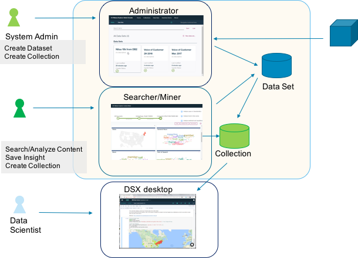
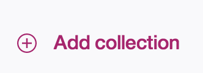

# WEX-12-Enablement-Classification

# Introduction
<!-- Main intro section

In several paragraphs, explain the basic concepts and tools that are used in the tutorial and why.

What is the business value you get from doing this tutorial?

Identify the best practices and architectures on the GM site in line.

Supply the link to the Github project that contains the code used in the tutorial.-->

[Insert the main intro section text here.]

<!--This is a shorter intro section that briefly explains the steps the user will complete or what the user will learn by completing the tutorial.-->

<-- -------------------------------------------- -->

[In this tutorial you will: 
  
    * Do this
    * Then this
    * Then this]

<!-- If you need to include content for IBMers only, add the content within the ibm Only tags. For example: -->

<-- -------------------------------------------- -->
# Prerequisites
<!--Provide a numbered list of pre-requisites.  Assume that the people taking the 
tutorials have no prior knowledge of any of the technology used. If there is an environment that can be used to run the tutorial, you must create it and point to it from the prerequisites.  Ensure that you can run through the tutorial on the environment specified. A few example pre-requisites are included below. Replace the steps with your own.-->

1. Download and install Watson Explorer Community Edition from the public download site <a href="https://www.ibm.com/us-en/marketplace/content-analytics">Try Free Edition</a>.

2. Make sure Docker is running.

3.  Other requirements

<-- -------------------------------------------- -->

# Task 1 - Name of first task

[Provide introductory information about this task here.  Explain what it is that they will be doing in the task and, more importantly, why they are doing it.]

<!--Provide the steps for the first task in the tutorial below.  Some example steps are provided below.  These example steps show you how to use markdown formatting for bold text, inserting images, and bulleted lists.-->

1. Launch the <a href="https://localhost/admin/main/#/">Administration Console</a>, and log in.

2. The following diagram shows the **Watson Explorer Architecture**.

 

3.  More steps

4. Click **Add Collection**. 

 * bla bla 
 
 * bla bla 
 
 * bla bla 
 

<-- -------------------------------------------- -->

# Task 2 - Name of second task

[Provide introductory information about this task here.]

<!--Provide the steps for the second task in the tutorial below.-->

1. Step 1.

2. Step 2.

3. Step 3.

<-- -------------------------------------------- -->

# Task 3 - Name of third  task

[Provide introductory information about this task here.]

<!--Provide the steps for the second task in the tutorial below.-->

1. Step 1.

2. Step 2.

3. Step 3.

<-- -------------------------------------------- -->

<!-- Add additional tasks as needed. -->

<-- -------------------------------------------- -->

# Summary

<!--Include a summary of what the user learned by completing the tutorial-->

You completed the tutorial. Congratulations! 

In this tutorial, you completed these tasks:

  * Task 1
  * Task 2
  * Task 3  

<-- -------------------------------------------- -->
